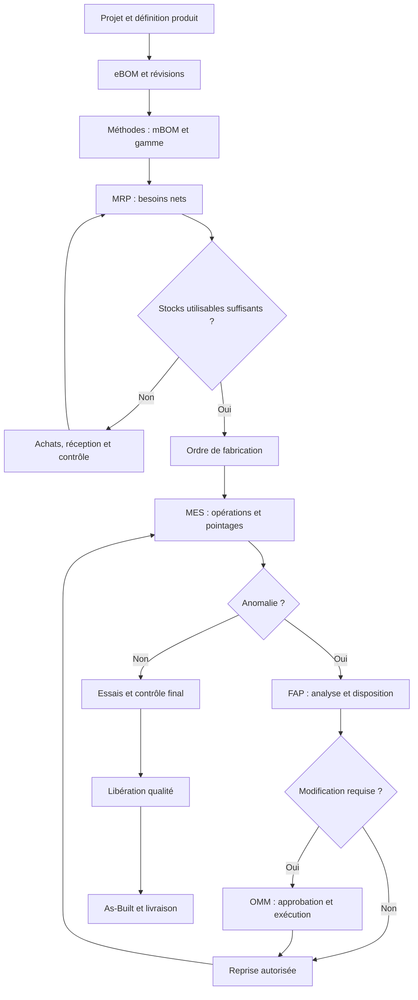
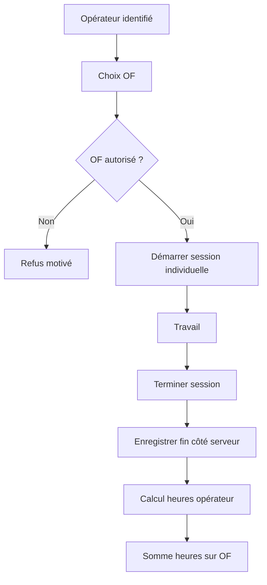
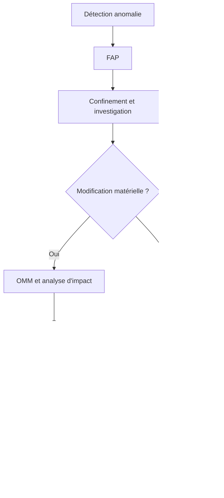

# Logigrammes métiers (Mermaid)

## Cycle de fabrication

```mermaid
flowchart TD
 A[Projet et définition produit] --> B[eBOM et révisions]
 B --> C[Méthodes : mBOM et gamme]
 C --> D[MRP : besoins nets]
 D --> E{Stocks utilisables suffisants ?}
 E -- Non --> F[Achats, réception et contrôle]
 F --> D
 E -- Oui --> G[Ordre de fabrication]
 G --> H[MES : opérations et pointages]
 H --> I{Anomalie ?}
 I -- Oui --> J[FAP : analyse et disposition]
 J --> K{Modification requise ?}
 K -- Oui --> L[OMM : approbation et exécution]
 K -- Non --> M[Reprise autorisée]
 L --> M
 M --> H
 I -- Non --> N[Essais et contrôle final]
 N --> O[Libération qualité]
 O --> P[As-Built et livraison]
```

## Pointage individuel

```mermaid
flowchart TD
 A[Opérateur identifié] --> B[Choix OF]
 B --> C{OF autorisé ?}
 C -- Non --> D[Refus motivé]
 C -- Oui --> E[Démarrer session individuelle]
 E --> F[Travail]
 F --> G[Terminer session]
 G --> H[Enregistrer fin côté serveur]
 H --> I[Calcul heures opérateur]
 I --> J[Somme heures sur OF]
```

## FAP / OMM

```mermaid
flowchart TD
 A[Détection anomalie] --> B[FAP]
 B --> C[Confinement et investigation]
 C --> D{Modification matérielle ?}
 D -- Oui --> E[OMM et analyse d'impact]
 E --> F[Approbation]
 F --> G[Intervention et vérification]
 D -- Non --> H[Disposition approuvée]
 G --> I[Contrôle qualité]
 H --> I
 I --> J[Clôture et traçabilité As-Built]
```
